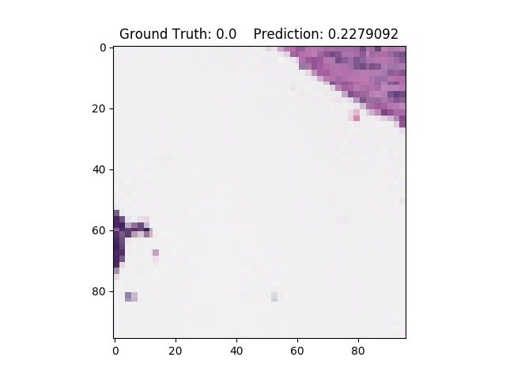
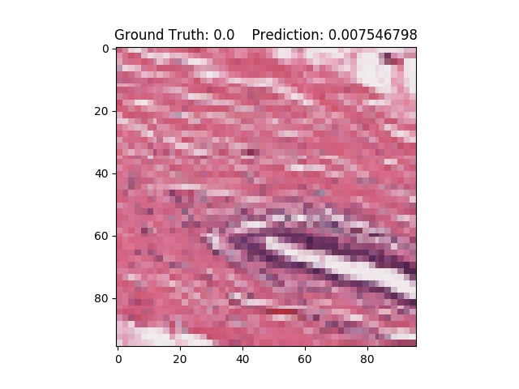
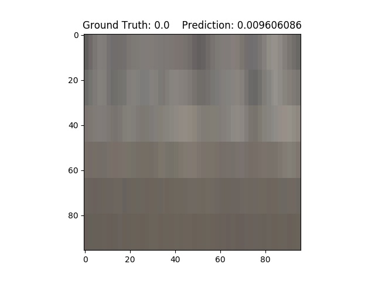
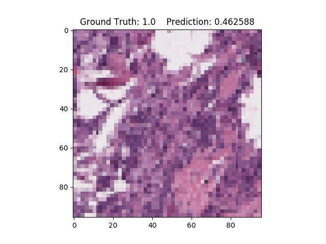
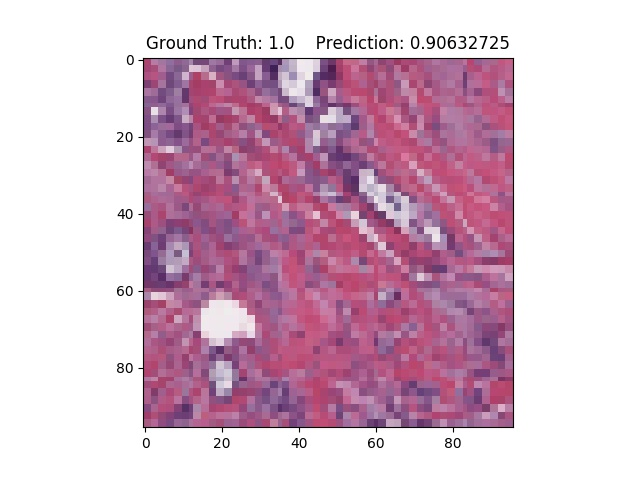

# Breast Cancer Classification Model

## Description
This is a simple deep learning classification model for the classification of histopathological images.
* The model: The backbone of the model is mobilenetv2 with a custom classification head. The network was pretrained on imagenet and
is taken from keras applications.
* The data: The dataset is an open breast cancer classification dataset 
(https://www.kaggle.com/paultimothymooney/breast-histopathology-images/data).
162 whole slide images where divided into 277,524 image patches of size 50 x 50 (198,738 IDC negative and 78,786 IDC positive).
The dataset was split into training (70%), validation (10%) and test (20%) set. The script for splitting can be found in
./src/sample_subsets.py.  

The model was so far just trained for 60 epochs with 1000 batches per epoch because of heavy hardware limitations 
(trained on a laptop CPU for ~18h). Here you see the training and validation accuracy:

The validation accuracy is unstable because it evaluates on 100 random batches of the validation set (else it would take too long).
The network has not converged yet but was trained to an accuracy of ~90%.

Here are some example images with ground truth and network predictions (0=no cancer, 1=cancer):

## Usage
To make this code run on your machine you need to:
* download the dataset from https://www.kaggle.com/paultimothymooney/breast-histopathology-images/data
* set up a virtual environment and activate it
* pip install the requirements: `pip install -r requirements.txt`
* Run the network: 
    * To see the usage options `python src/main.py -h`
    * please make sure you define the correct dataset path