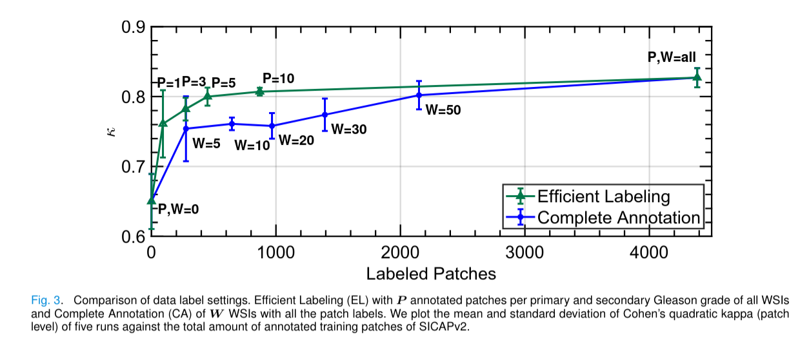
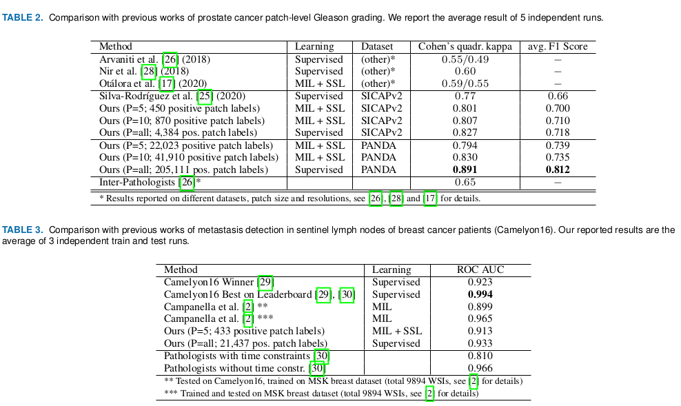

# Coupling Semi-Supervised and Multiple Instance Learning for Histopathological Image Classification 
This is the code of the paper Coupling Semi-Supervised and Multiple Instance Learning for Histopathological Image Classification by
Arne Schmidt, Julio Silva-Rodŕıguez, Rafael Molina, and Valery Naranjo.
We try our best to make the code reusable and the experiments reproducible by giving a detailed instruction, description 
of dependencies, configurations and run commands:
## Installation and Usage
To make this code run on your linux machine you need to:
* Install miniconda (or anaconda): https://docs.anaconda.com/anaconda/install/linux/ 
* Set up a conda environment and activate it:
    * `conda env create --file environment.yaml`
    * `conda activate tensorlfow_2_3`
* Download dataset, see dataset_dependent folders READMEs:
    * ./dataset_dependent/camelyon16/README.md
    * ./dataset_dependent/sicapv2/README.md
* Edit the configuration:
    * `./config.yaml` for general settings
    * `./dataset_dependent/sicapv2/config.yaml` for dataset dependent settings
* Run the program:
    * `python ./src/main.py`
    
## Reproduce the Experiments of the Paper
In the paper we show the following experiment results for patch-level Gleason grading (on SICAPv2) and WSI-level breast 
cancer classification (on Camelyon16):

To run the experiments, please follow this instructions:

### Patch-level Gleason Grading of Prostate Cancer (SICAPv2)
1. Follow the steps above to install dependencies and download the dataset
2. Configure the path to the SICAPv2 dataset on your Pc:
    * open ./dataset_dependent/sicapv2/config.yaml
    * change the line   `dir: path/to/dataset/`
3. Run the experiments
    * Navigate into the base folder (cancer_classification)
    * The subfolders `efficient_labeling` and `complete_annotation` of `./dataset_dependent/sicapv2/experiments/` 
    contain the configurations of the experiments in Figure 2 of the paper. 
    * To train the model with efficient labeling (EL) and P=5 use f.e.:  
        * `python src/main.py -dc ./dataset_dependent/sicapv2/experiments/efficient_labeling/P_5/config.yaml`
    * To test the model use the test configurations test_config.yaml, f.e.:
        * `python src/main.py -dc ./dataset_dependent/sicapv2/experiments/efficient_labeling/P_5/test_config.yaml`
4. To see the output, see below description of logging

### WSI-level classification of Breast Cancer (Camelyon16)
1. Follow the steps above to install dependencies and download the dataset
    * Preprocessing is necessary, see `dataset_dependent/camelyon16/dataset_scripts/README.md`
2. Configure the path to the preprocessed Camelyon16 dataset on your Pc:
    * open ./dataset_dependent/camelyon16/config.yaml
    * change both paths   `dir: /path/to/cam16` and `data_split_dir: /path/to/cam16` to the 
    path of thepreprocessed dataset
3. Run the experiments with efficient labeling:
    * Navigate into the base folder (cancer_classification)
    * To train the model use the configurations of the subfolders of ./dataset_dependent/camelyon16/experiments/ f.e.:  
        * `python src/main.py -dc ./dataset_dependent/camelyon16/experiments/efficient_labeling/P_5/config.yaml`
    * To test the model use the test configurations test_config.yaml, f.e.:
        * `python src/main.py -dc ./dataset_dependent/camelyon16/experiments/efficient_labeling/P_5/test_config.yaml`
4. To see the output, see below description of logging.

## Experiment Logging
* Logging is done with mlflow (https://mlflow.org/docs/latest/tracking.html), it is already installed if you followed the installation guidlines above
* To see the experiment results, navigate into the base folder (cancer_classification). If you ran experiments, a mlruns folder should be present. 
* Run `mlflow ui`
* Open in your browser `localhost:5000` to see the results (training progress, metrics etc.)
* The models of the experiments by default are stored in the experiment subfolders, f.e. 
./dataset_dependent/sicapv2/experiments/efficient_labeling/P_5/models/